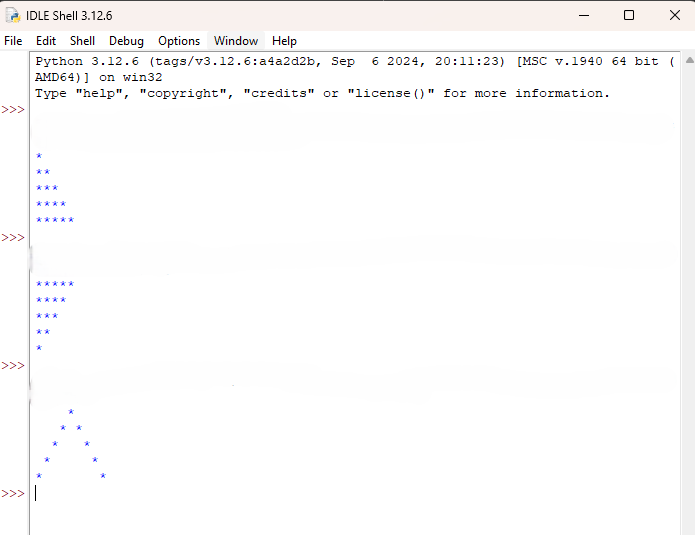

# 🧱 SWE4201 – Task 2: Geometric Pattern Generation in Python

This project is the second task of the **SWE4201: Introduction to Software Development** module. It focuses on using Python to generate geometric patterns through control flow and string manipulation. The scripts demonstrate foundational programming concepts such as nested loops, alignment logic, and console output formatting.

---

## 📌 Task Objectives

- Apply `for` loops and nested control structures  
- Practice string formatting and alignment  
- Reinforce algorithmic thinking through visual logic  
- Develop clean, readable Python scripts for structured output

---

## 🧩 Included Scripts

| Script Name                | Description                                      |
|---------------------------|--------------------------------------------------|
| `Right-angled Triangle.py`| Prints a left-aligned triangle using asterisks   |
| `Structure Pyramid.py`    | Prints a centered pyramid using asterisks and spaces |

Each script is designed to run independently and produce output directly in the Python shell.

---

## 📸 Screenshot

### Python Shell Output  
  
*Displays the execution of both scripts in Python IDLE Shell, showing the triangle and pyramid patterns.*

---

## 🚀 How to Run

To execute the scripts:

1. Open Python IDLE or any terminal with Python 3.x installed  
2. Navigate to the script directory  
3. Run each file individually:

```bash
python "Right-angled Triangle.py"
python "Structure Pyramid.py"
